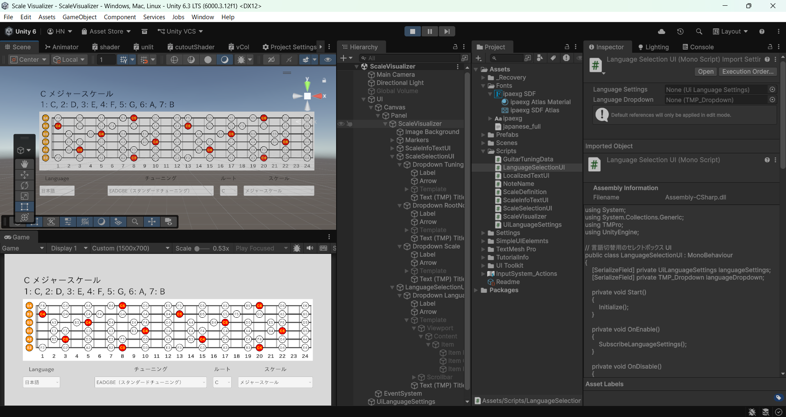

# Scale Visualizer

## 日本語

### 概要
`Scale Visualizer` は、Unity 上でギター指板のスケール構成音を可視化するためのプロジェクトです。  
チューニング、ルート音、スケール種別、言語表示を切り替えながら、指板上のノート配置とスケール情報を確認できます。

### スクリーンショット

### 主な機能
- ギター指板上へのスケールノート表示
- 開放弦・ルート音の強調表示
- フレット線、弦線、フレット番号の表示
- チューニング選択
- ルート音選択
- スケール選択
- 日本語 / 英語 UI 切替
- スケール構成音の度数表示

### 主要コンポーネント
- `ScaleVisualizer`  
  指板描画の中心となるコンポーネントです。  
- `ScaleSelectionUI`  
  チューニング、ルート音、スケールを選択する UI です。  
- `ScaleInfoTextUI`  
  スケール名と構成音を表示する UI です。  
- `LanguageSelectionUI`  
  日本語 / 英語を切り替える UI です。  
- `LocalizedTextUI`  
  固定テキストを言語に応じて切り替える UI です。  
- `UiLanguageSettings`  
  UI 全体の言語設定を管理します。  
- `GuitarTuningData` / `ScaleDefinition`  
  チューニング定義とスケール定義を保持するデータクラスです。

### 注意
- TextMeshPro を使用しています。  
- 日本語表示には日本語グリフを含むフォントアセットが必要です。  
- Unity Editor 上では設定変更時に自動再生成されます。

---

## English

### Overview
`Scale Visualizer` is a Unity project for visualizing scale notes on a guitar fretboard.  
You can switch tuning, root note, scale type, and UI language while inspecting the resulting note layout and scale information.

### Screenshot
> Place screenshot images in `docs/images/`.  
> Example: `docs/images/scale-visualizer-overview.png`

### Features
- Scale note visualization on a guitar fretboard
- Highlighting for open strings and root notes
- Fret lines, string lines, and fret number display
- Tuning selection
- Root note selection
- Scale selection
- Japanese / English UI switching
- Degree-based scale note display

### Main Components
- `ScaleVisualizer`  
  Core component responsible for fretboard rendering.  
- `ScaleSelectionUI`  
  UI for selecting tuning, root note, and scale.  
- `ScaleInfoTextUI`  
  UI for displaying the scale title and scale tones.  
- `LanguageSelectionUI`  
  UI for switching between Japanese and English.  
- `LocalizedTextUI`  
  UI helper for switching fixed text by language.  
- `UiLanguageSettings`  
  Centralized UI language settings manager.  
- `GuitarTuningData` / `ScaleDefinition`  
  Data classes for tuning definitions and scale definitions.

### Notes
- This project uses TextMeshPro.  
- A font asset with Japanese glyph support is required for Japanese text rendering.  
- In the Unity Editor, the visualization regenerates automatically when settings change.
